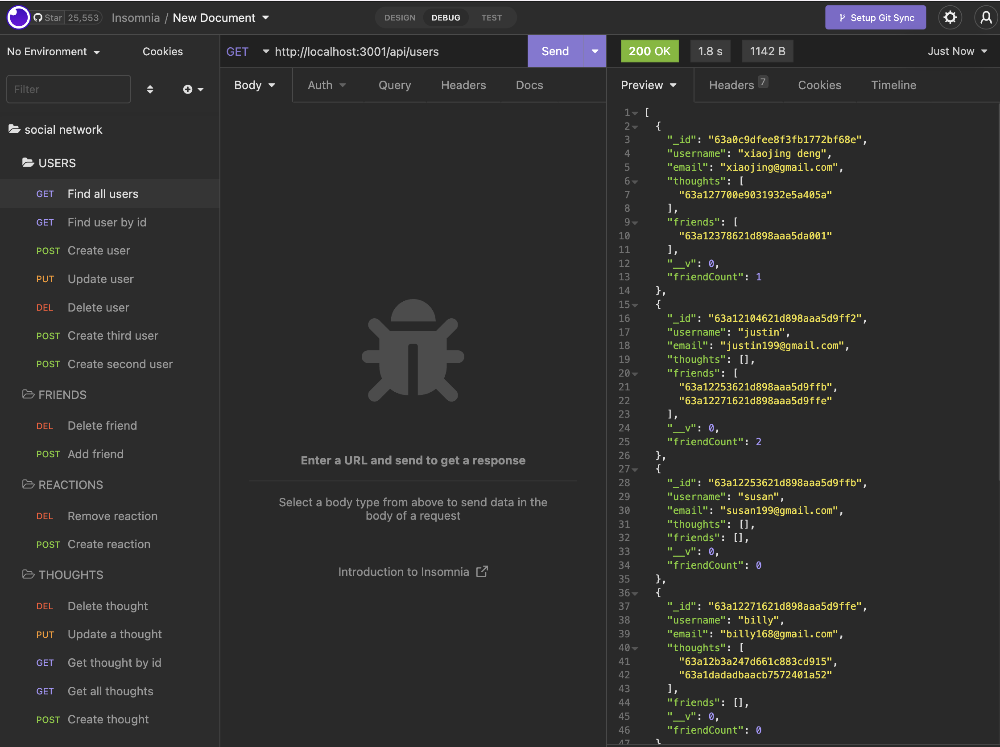

<h1>Social Network👋</h1>

## Badges


## Description
🔍 This is an API for a social network application where users can share their thoughts, add friend list, remove friend, and react to friends thoughts. It uses Express.js for routing, a MongoDB database, the mongoose ODM, and moment.js to format timestamps. The seed data is created using Insomnia.
To see how the API works using Insomnia, below link is the **walk-through demonstration videos**:
https://drive.google.com/file/d/1DhH9WTA51WXPyug_9IyxcF9DA6l_bER0/view?usp=share_link

<video  width="500" height="400" controls>
  <source src="utils/social-network.mp4" type="video/mp4">
</video>


https://user-images.githubusercontent.com/110792983/208991759-bcf586bb-738c-4cf7-95b6-92a426c0fc08.mp4


On the left side below screenshot, you can see all  GET POST PUT DELETE route for Users, Thoughts, Friends, Reactions.


## Table of Contents
- [Description](#description)
- [Installation](#installation)
- [Usage](#usage)
- [Technologies](#technologies)
- [Contributing](#contributing)
- [License](#license)
- [Questions](#questions)


## Installation
1. Clone repository to use the application on local machine<br/>
2. Node.js and MongoDB is required to run the application.<br/>
3. To install necessary dependencies, run the following command: ```npm i```<br/>

## usage
💻 
1. After following the installation instructions, run ```npm start``` to start the server. 
2. When the server is started, the MongoDb models are synched to the MongoDB database.
3. Open MongoDB and connect to the MongoDB URI ```mongodb://localhost:27017```. On the list of databases, click on ```socialDB``` to see ```user``` and ```thoughts``` data.
4. Go to Insomnia through localhost to create seed data and test the API routes, also see the tests section below.


## Technologies 🔧
- [JavaScript](https://developer.mozilla.org/en-US/docs/Web/JavaScript)
- [Express.js](https://expressjs.com/)
- [Node.js](https://nodejs.org/en/)
- [MongoDB](https://www.mongodb.com/)
- [Mongoose](https://mongoosejs.com/)
- [Insomnia](https://insomnia.rest/)
- [Moment.js](https://www.npmjs.com/package/moment)

## Contributor
👥 Xiaojing Deng


## License

</br>
<p>Permission to use this application is granted under the MIT license.</p>
 
[MIT](https://choosealicense.com/licenses/mit)


## Tests
Insomnia is used to test API calls. Please see the walk-through demonstration video:<br/> https://drive.google.com/file/d/1DhH9WTA51WXPyug_9IyxcF9DA6l_bER0/view?usp=share_link.<br/>

On Insomnia, the following API routes have been created:<br/>

**USER**

- Create a new user: `POST /api/users`
- Get all users: `GET /api/users`
- Get a single user by `id`: `GET /api/users/:userId`

- Update a user by `id`: `PUT /api/users/:userId`

- Delete a user by `id`: `DELETE /api/user/:userId`

**FRIEND**

- Add a new friend to a user's friend list: `POST /api/users/:userid/friends/:friendId`
- Delete a friend from a user's friend list: `DELETE /api/users/:userid/friends/:friendId`

**THOUGHT**

- Create a new thought: `POST /api/thoughts/`
- Get all thoughts: `GET /api/thoughts/`
- Get a single thought by `id`: `GET /api/thoughts/:thoughtId`
- Update a thought by `id`: `PUT /api/thoughts/:thoughtId`
- Delete a thought by `id`: `DELETE /api/thoughts/:thoughtId`

**REACTION**

- Create a reaction: `POST /api/thoughts/:thoughtId/reactions`
- Delete a reaction by the `reactionId`: `DEL /api/thoughts/:thoughtId/reactions/:reactionId`


## Questions
✋Reach me here:<br/>
:octocat: Find me on GitHub: [xiaojing168jmg168](https://github.com/xiaojing168jmg168)<br/>
📩 Email me with any questions: 8redfishcreative@gmail.com


